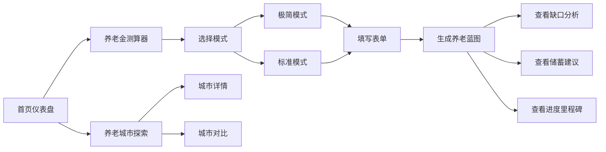

# 养老准备系统 Web端 MVP 产品需求文档

## 1. 产品概述

养老准备系统Web端MVP —— 一款面向全年龄段用户的AI养老规划助手，以"游戏化进度追踪"为前端交互核心，以"AI智能决策引擎"为后端骨架，帮助用户从年轻时就开始系统化地准备养老。

- 核心价值：30秒快速测算养老缺口，一页纸看清养老蓝图，游戏化进度让储蓄有成就感
- 目标用户：30-50岁有养老规划意识的人群
- Web端定位：大屏分析 + 复杂测算，提供深度分析体验

## 2. 核心功能

### 2.1 用户角色
| 角色 | 注册方式 | 核心权限 |
|------|---------|---------|
| 普通用户 | 无需注册（本地存储） | 使用所有测算功能、查看进度、浏览城市数据 |

### 2.2 功能模块
1. **首页/仪表盘**：游戏化进度总览、核心数据卡片、快速入口
2. **养老金测算器**：极简模式（30秒）/ 标准模式（2分钟）分层输入
3. **养老蓝图**：一页纸可视化结果，三支柱状态、缺口分析、储蓄建议
4. **进度追踪**：里程碑拆解、任务系统、成就体系
5. **养老城市**：城市数据库、多维度对比、智能推荐

### 2.3 页面详情
| 页面名称 | 模块名称 | 功能描述 |
|---------|---------|-----------|
| 首页仪表盘 | 进度概览 | 总进度百分比环形图、距下个里程碑提示 |
| 首页仪表盘 | 核心指标卡片 | 目标金额、已储蓄、缺口、建议月存额 |
| 首页仪表盘 | 快捷操作 | 快速测算、查看蓝图、探索城市入口 |
| 测算器页 | 模式切换 | 极简模式/标准模式切换 |
| 测算器页 | 表单输入 | 年龄、城市、收入、存款、退休年龄等输入 |
| 测算器页 | 实时预估 | 输入过程中实时更新预估结果 |
| 蓝图结果页 | 三支柱概览 | 社保、企业年金、个人养老金可视化对比 |
| 蓝图结果页 | 缺口分析 | 总缺口金额、缺口年限、倒推储蓄计划 |
| 蓝图结果页 | 情景模拟 | 保守/中性/乐观三种情景切换 |
| 进度追踪页 | 里程碑 | 年度/季度里程碑时间线 |
| 进度追踪页 | 任务系统 | 储蓄任务、知识任务、探索任务 |
| 进度追踪页 | 成就墙 | 已解锁/待解锁成就展示 |
| 养老城市页 | 城市列表 | 城市卡片展示、筛选排序 |
| 养老城市页 | 城市详情 | 五维度评分雷达图、生活成本明细 |
| 养老城市页 | 城市对比 | 最多3个城市多维度对比 |

## 3. 核心流程

用户打开Web端 → 首页展示默认进度仪表盘 → 点击"开始测算"进入测算器 → 选择模式（极简/标准）→ 填写表单 → 生成养老蓝图 → 查看缺口和储蓄建议 → 可查看进度里程碑 → 可探索养老城市

## 4. 用户界面设计

### 4.1 设计风格
- **主色调**：深青色/墨绿 + 暖金色点缀 —— 传达稳健、专业、温暖的养老规划氛围
- **辅助色**：米色/奶油白背景，营造安心舒适感
- **按钮风格**：圆角胶囊形按钮，主按钮有渐变和微阴影
- **字体**：标题用衬线字体（Noto Serif SC）营造专业感，正文用无衬线（Noto Sans SC）保证可读性
- **布局风格**：卡片式布局，大量留白，数据可视化突出
- **图标风格**：线性图标，统一圆角，配合emoji增加亲切感

### 4.2 页面设计概述
| 页面名称 | 模块名称 | UI元素 |
|---------|---------|--------|
| 首页仪表盘 | 进度概览 | 大型环形进度条，渐变色填充，数字动画，悬停微动效 |
| 首页仪表盘 | 核心指标 | 玻璃拟态卡片，悬停上浮，数据大字展示 |
| 测算器页 | 表单输入 | 分步引导式表单，大输入框，实时校验反馈 |
| 蓝图结果页 | 数据可视化 | 三支柱堆叠柱状图、缺口漏斗图、储蓄曲线 |
| 进度追踪页 | 里程碑 | 时间轴设计，完成项打勾动画，当前项高亮 |
| 养老城市页 | 城市卡片 | 图片+评分卡片，悬停放大效果，五维进度条 |

### 4.3 响应式
- 桌面端优先（1280px+），适配大屏数据展示
- 平板端（768-1279px）：两栏布局变单栏，卡片重排
- 移动端（<768px）：简化展示，核心功能保留，导航底部化

### 4.4 动效设计
- 页面入场：元素渐入+上移，错峰出现
- 数据变化：数字滚动动画，图表绘制动画
- 交互反馈：按钮按压微缩，卡片悬停上浮+阴影加深
- 进度更新：环形进度条平滑过渡，里程碑解锁有庆祝动效
