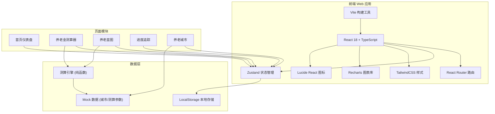

## 1. 架构设计



## 2. 技术描述

- **前端框架**：React 18 + TypeScript
- **构建工具**：Vite 5.x
- **路由管理**：React Router DOM 6.x
- **状态管理**：Zustand
- **样式方案**：TailwindCSS 3.x
- **图表可视化**：Recharts
- **图标库**：Lucide React
- **后端**：无（纯前端 MVP，数据本地存储）
- **数据库**：LocalStorage（用户数据）+ Mock 数据（城市/参数配置）

## 3. 路由定义

| 路由 | 页面 | 用途 |
|------|------|------|
| `/` | 首页仪表盘 | 进度总览、核心指标、快捷入口 |
| `/calculator` | 养老金测算器 | 分层输入表单、实时预估 |
| `/blueprint` | 养老蓝图 | 三支柱概览、缺口分析、储蓄建议 |
| `/progress` | 进度追踪 | 里程碑、任务系统、成就墙 |
| `/cities` | 养老城市 | 城市列表、详情、对比 |

## 4. 数据模型

### 4.1 用户测算数据
```typescript
interface UserProfile {
  // 基础信息
  age: number;
  currentCity: string;
  monthlyIncome: number;
  currentSavings: number;
  targetCity: string;
  expectedRetirementAge: number;
  
  // 标准模式补充
  socialInsuranceYears: number;
  socialInsuranceBase: number;
  lifestyleLevel: 'basic' | 'comfortable' | 'luxury';
  
  // 专业模式补充（MVP暂不实现，预留字段）
  enterpriseAnnuity?: number;
  personalPension?: number;
  investmentDetails?: InvestmentItem[];
  spouseInfo?: SpouseInfo;
  healthExpectancy?: number;
}

interface InvestmentItem {
  type: string;
  amount: number;
  expectedReturn: number;
}

interface SpouseInfo {
  age: number;
  monthlyIncome: number;
  socialInsuranceYears: number;
}
```

### 4.2 测算结果
```typescript
interface CalculationResult {
  threePillars: {
    socialSecurity: { monthlyAmount: number; totalAmount: number };
    enterpriseAnnuity: { monthlyAmount: number; totalAmount: number };
    personalPension: { monthlyAmount: number; totalAmount: number };
  };
  totalGap: number;
  monthlyGap: number;
  suggestedMonthlySavings: number;
  yearsToRetirement: number;
  expectedRetirementYears: number;
  targetMonthlyExpense: number;
  scenarios: {
    conservative: CalculationScenario;
    moderate: CalculationScenario;
    optimistic: CalculationScenario;
  };
}

interface CalculationScenario {
  returnRate: number;
  totalGap: number;
  suggestedMonthlySavings: number;
}
```

### 4.3 进度数据
```typescript
interface ProgressData {
  totalTarget: number;
  currentSavings: number;
  progressPercentage: number;
  milestones: Milestone[];
  tasks: Task[];
  achievements: Achievement[];
}

interface Milestone {
  id: string;
  title: string;
  targetAmount: number;
  currentAmount: number;
  deadline: string;
  status: 'completed' | 'in_progress' | 'pending';
}

interface Task {
  id: string;
  title: string;
  type: 'savings' | 'knowledge' | 'exploration';
  progress: number;
  reward: number;
  deadline: string;
}

interface Achievement {
  id: string;
  title: string;
  description: string;
  icon: string;
  unlocked: boolean;
  unlockedAt?: string;
}
```

### 4.4 城市数据
```typescript
interface CityData {
  id: string;
  name: string;
  province: string;
  image: string;
  scores: {
    costOfLiving: number;
    healthcare: number;
    climate: number;
    socialSupport: number;
    transportation: number;
  };
  costDetails: {
    rent: { basic: number; comfortable: number; luxury: number };
    food: number;
    transportation: number;
    utilities: number;
    total: { basic: number; comfortable: number; luxury: number };
  };
  highlights: string[];
}
```

## 5. 项目结构

```
src/
├── components/          # 通用组件
│   ├── layout/         # 布局组件（导航、页脚等）
│   ├── ui/             # 基础UI组件（按钮、卡片、输入框等）
│   └── charts/         # 图表组件
├── pages/              # 页面组件
│   ├── Dashboard/
│   ├── Calculator/
│   ├── Blueprint/
│   ├── Progress/
│   └── Cities/
├── store/              # Zustand 状态管理
│   └── useStore.ts
├── utils/              # 工具函数
│   ├── calculator.ts   # 测算引擎
│   └── format.ts       # 格式化工具
├── data/               # Mock 数据
│   ├── cities.ts
│   └── constants.ts
├── types/              # TypeScript 类型定义
│   └── index.ts
├── App.tsx
├── main.tsx
└── index.css
```

## 6. 测算引擎核心算法

### 6.1 社保养老金测算（简化版）
- 基础养老金 = 退休时上年度社平工资 × (1 + 平均缴费指数) ÷ 2 × 缴费年限 × 1%
- 个人账户养老金 = 个人账户储存额 ÷ 计发月数
- MVP版本使用简化公式和城市平均参数估算

### 6.2 养老缺口计算
```
总需求 = 目标城市月生活费 × 预期养老年限 × 12
总收入 = (社保月领取 + 企业年金月领取 + 个人养老金月领取) × 预期养老年限 × 12
       + 现有资产终值
总缺口 = 总需求 - 总收入
```

### 6.3 倒推储蓄计划
```
每月需储蓄 = 总缺口 × 月利率 / [(1 + 月利率)^月数 - 1]
其中：月利率 = 年化收益率 / 12，月数 = 距退休年数 × 12
```
